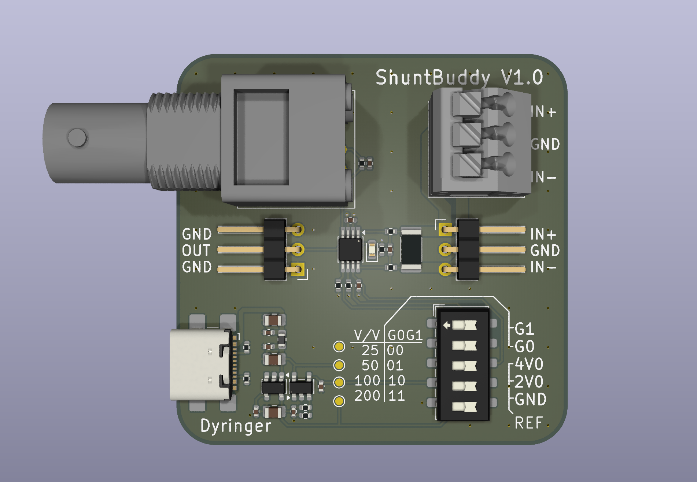

# ShuntBuddy ⚡

<table>
  <tr>
    <td>  </td>
  </tr>
</table>

**ShuntBuddy** is an active oscilloscope adapter designed for precise current measurement. It eliminates the hassle of measuring high-side current by converting the voltage drop across a shunt resistor into a buffered, amplified signal that your oscilloscope can easily display.

## How it Works

ShuntBuddy sits between your power supply and your load. It uses the **Texas Instruments INA225**—a fully integrated, programmable gain difference amplifier. The device captures the tiny voltage drop across an internal 10mΩ shunt and scales it up.

Simply connect ShuntBuddy to your scope via a BNC cable, power it via USB-C, and your current readings appear as a voltage signal.

---

---

## Technical Specifications

* **Amplifier:** INA225 (High-precision, integrated gain resistors)
* **Input Shunt:** 10mΩ ()
* **Power Input:** USB-C (5V)
* **Output:** BNC (Compatible with all standard oscilloscopes)
* **Form Factor:** Current-to-Voltage Probe (acts like a x10 or x100 scaling factor depending on settings)

### Gain & Current Ranges

With the onboard **10mΩ shunt**, the following ranges are available via the DIP switch:

| Setting | Gain () | Scale Factor | Max Current (at 5V Output) |
| --- | --- | --- | --- |
| **G1** | 25 | 250 mV/A | **16.0 A** |
| **G2** | 50 | 500 mV/A | **8.0 A** |
| **G3** | 100 | 1 V/A | **4.0 A** |
| **G4** | 200 | 2 V/A | **2.0 A** |

---

## Configuration

### 1. Gain Selection (DIP Switch)

The INA225 allows you to hardware-configure the gain. This is useful for "zooming in" on low-power signals (G4) or measuring high-current surges (G1) without clipping the output.

### 2. Reference Voltage ()

You can shift the "zero" point of your measurement to handle different scenarios:

* **4V Reference:** Optimized for **Unidirectional** measurement (Current flowing from Source to Load). Provides the widest dynamic range for power consumption analysis.
* **2V Reference:** Optimized for **Bidirectional** measurement. This centers the zero point, allowing you to see both charging and discharging currents (positive and negative swings).
